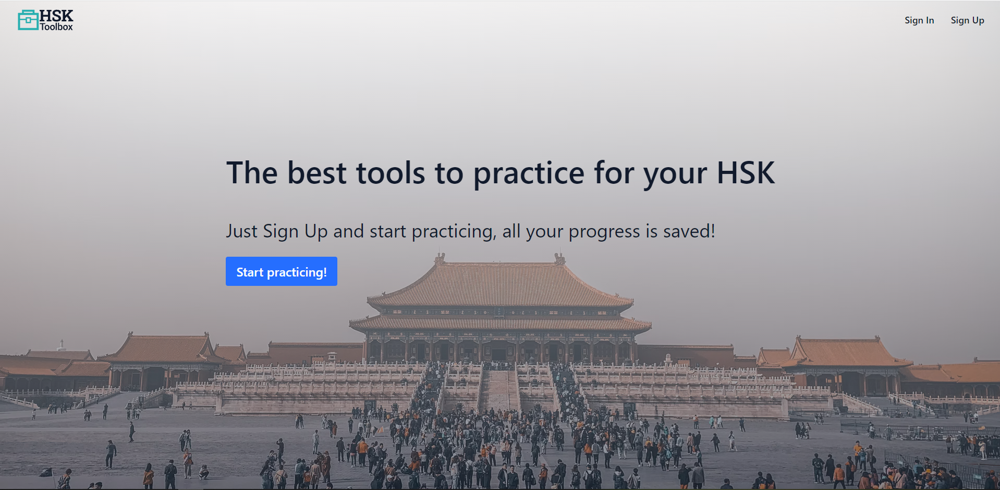
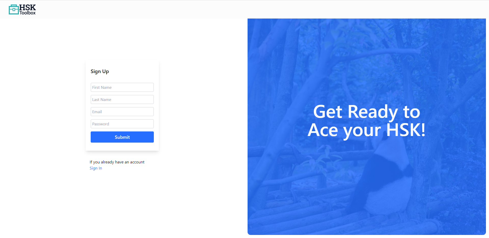
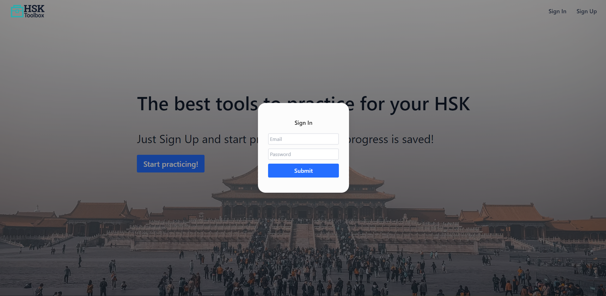
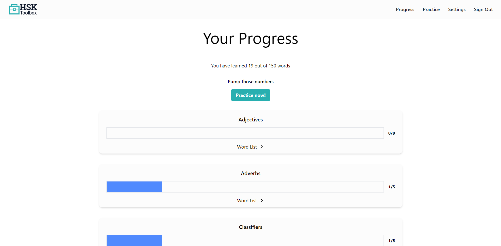
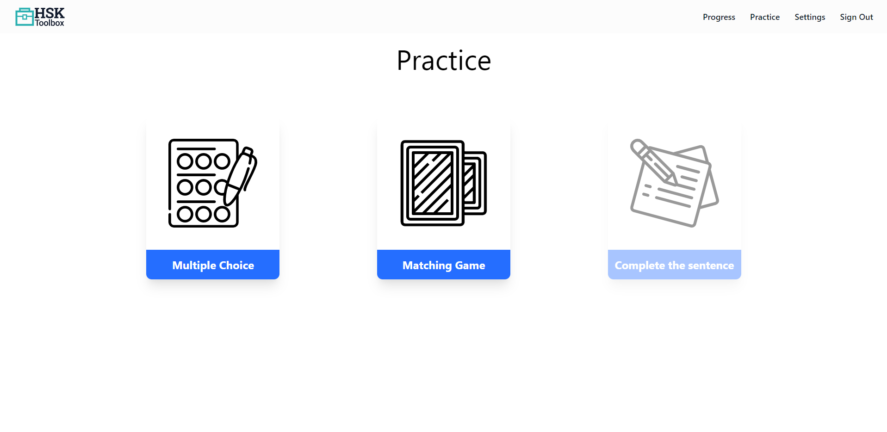
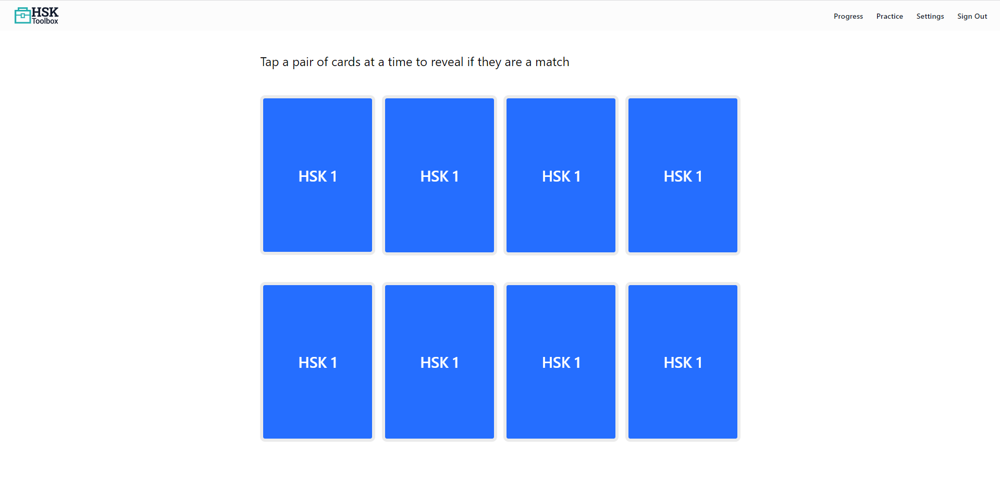
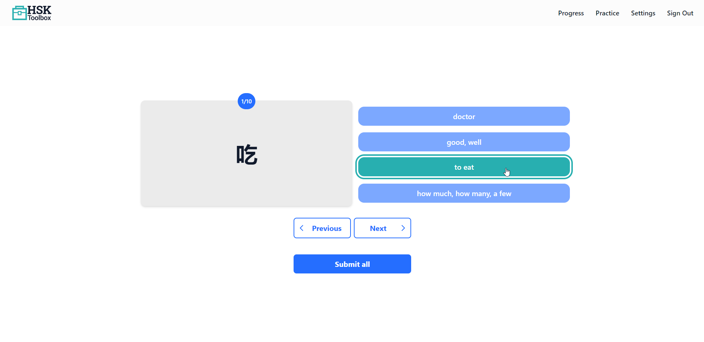
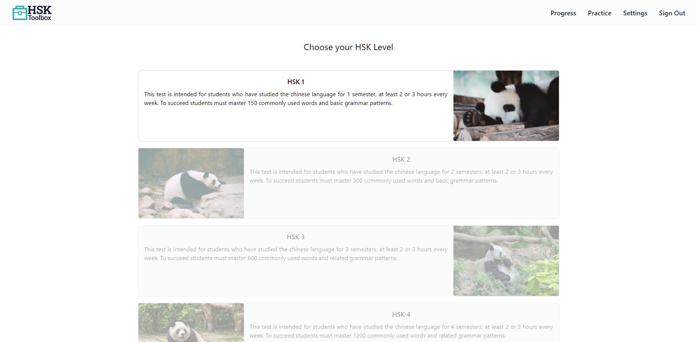

# HSK Toolbox

  

## General info

HSK Toolbox is a Full Stack Web Application that allows you to practice your HSK vocabulary with different games and keeps track of the progress you make.

You can see the live site in this [link.](https://hsktoolboxdemo.herokuapp.com/)

## Technologies

- **React.js**
- **Redux**
- **TailwindCSS**
- **Express.js**
- **MongoDB**
- **JSON Web Tokens**
- **Passport**
## Features

### Home

  

The Home page welcomes you to the website, it has a button and navigation bar to explore the website, from here you can sign up or sign in if you already have an account.

### Sign Up

  

This form was created with the library **redux-form**. After validating the data in the frontend and in the backend, it is stored in a **MongoDB** Database

### Sign In

  

The modal was created using the Dialog from **headless.ui** and the form with the library **redux-form**. After signing in, you are issued a **JSON Web Token** to validate your identity.

### Progress

  

Here you can track all the vocabulary you have practiced in the games, if you got them correct, they are marked as *learned*. You can expand each category to see the word list.

### Practice

  

Here you can choose the game you want to play in order to practice the HSK vocabulary.

### Matching Game

  

This is the classic matching game where you have to tap a pair of cards until you find the chinese character and its matching english meaning.

### Multiple Choice

  

In this game you are given a chinese chracter and four possible answers, after answering all the questions and submitting, you can watch the results.

### Complete Sentence
*Coming soon...*
### Settings

  

Here you can choose the HSK level that you want to practice, it is necessary to choose one before start practicing.
